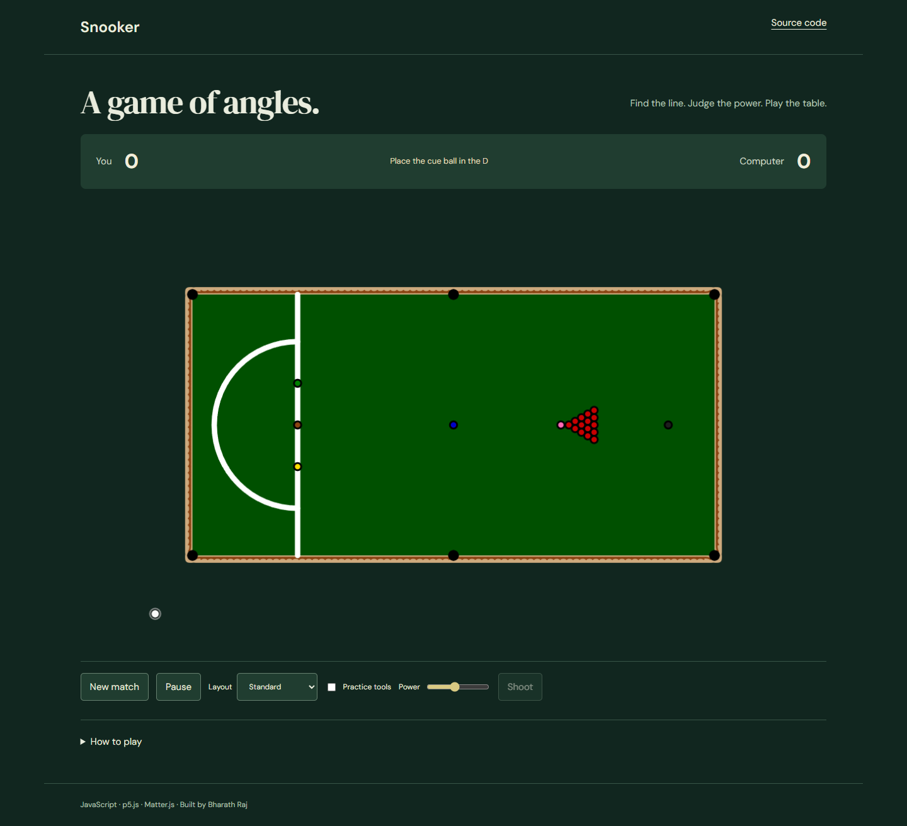

# Snooker

A physics prototype needs more than a canvas to explain a match. This browser game adds a clear match interface around a snooker-inspired table and a computer opponent.



## Demo

Local preview works with the setup below. GitHub Pages publication is pending destination authentication; a live URL will be added after verification.

## What it does

- DOM scoreboard, turn/target status, power control, restart, pause and HTML help.
- Pointer aiming and A/D keyboard aiming, with pointer pullback or an accessible Shoot button.
- Stable world coordinates during resizing: the CSS presentation scales without resetting play.
- Separate practice tools, three layouts and guarded CPU thinking timers.
- Pot scoring, red/color target transitions, final color sequence and simplified foul awards.

## Run locally

```sh
python -m http.server 8000 --bind 127.0.0.1
```

Open http://127.0.0.1:8000/ in a modern browser. Run the command inside this repository. Do not open `index.html` directly from disk: local datasets/model assets use HTTP. Python 3 is only a local static server; no application build is required.

## Controls

Drag the white cue ball from its holder into the D. Aim with the pointer or hold A/D. Pull back and release to shoot, or choose Power and activate Shoot. New match resets the table. Layout changes reset the match. Practice tools enable force-pot experiments and should not be used for a competitive match.

## Architecture and decisions

`sketch.js` owns the match state and p5 rendering; `interface.js` presents state in HTML. `ball.js`, `table.js` and `cue.js` manage table entities. Matter.js handles motion/collisions. `cpuPlayer.js` searches eligible objects and pockets; generation checks discard pending CPU callbacks after resets.

## Limitations

This is simplified snooker. It covers pot values, red/color alternation, color sequence, cue-ball and wrong-ball pot penalties. It does not implement tournament miss/free-ball rules, complete first-contact foul adjudication, or reliable maximum-per-shot aggregation for simultaneous fouls. The CPU uses geometric heuristics rather than a trained policy. Physics and endgame tie handling are game approximations.

## Validation

Edge checks cover launching, a shot, paused resize persistence, reset to 15 reds and six pockets, wrong-color foul award without score subtraction, and stale CPU callback cancellation. Full rule coverage is intentionally not claimed.

## Third-party attribution

p5.js and Matter.js retain their supplied notices; dependency license texts are in `third-party/`. The original JavaScript game architecture is preserved.

